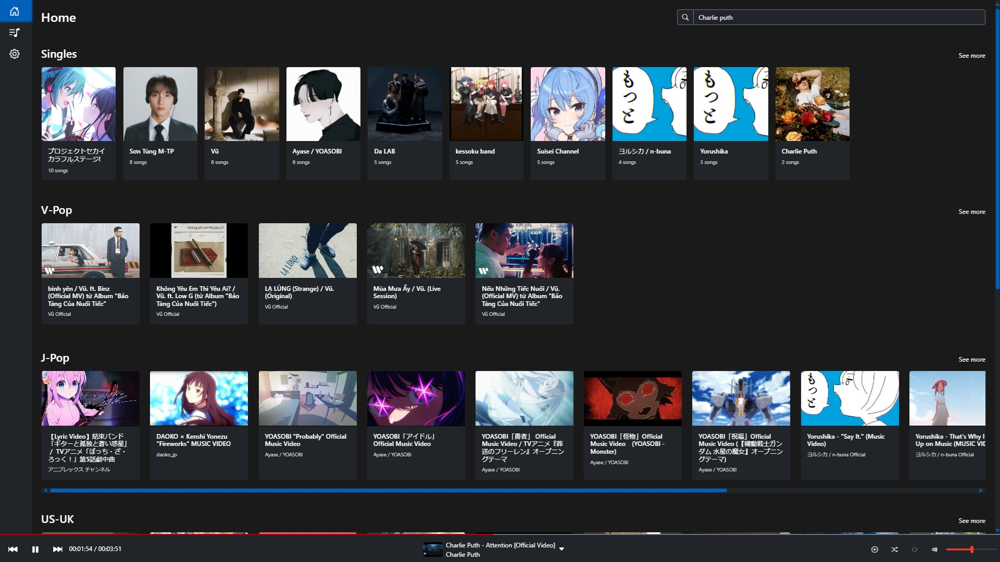
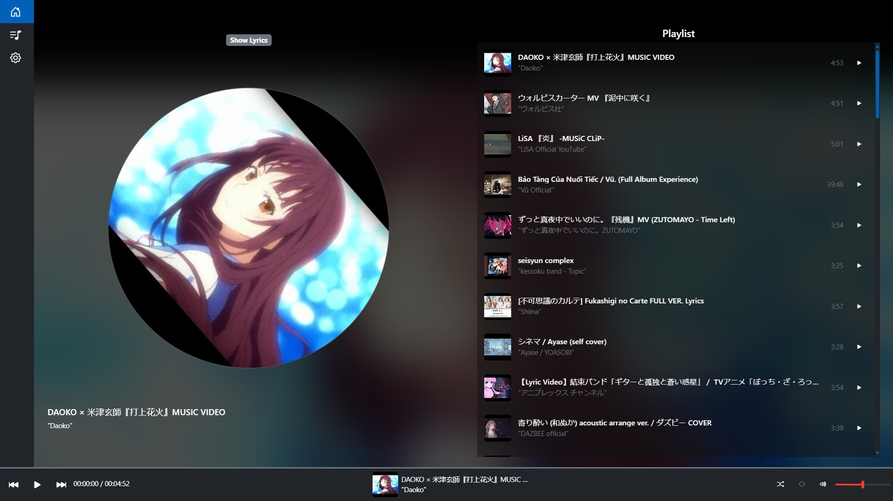
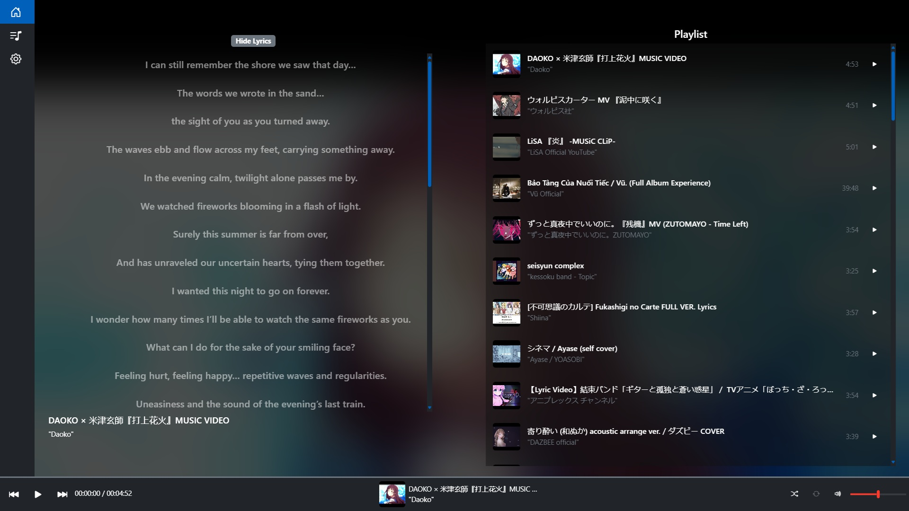
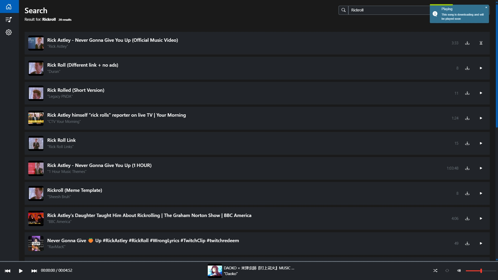
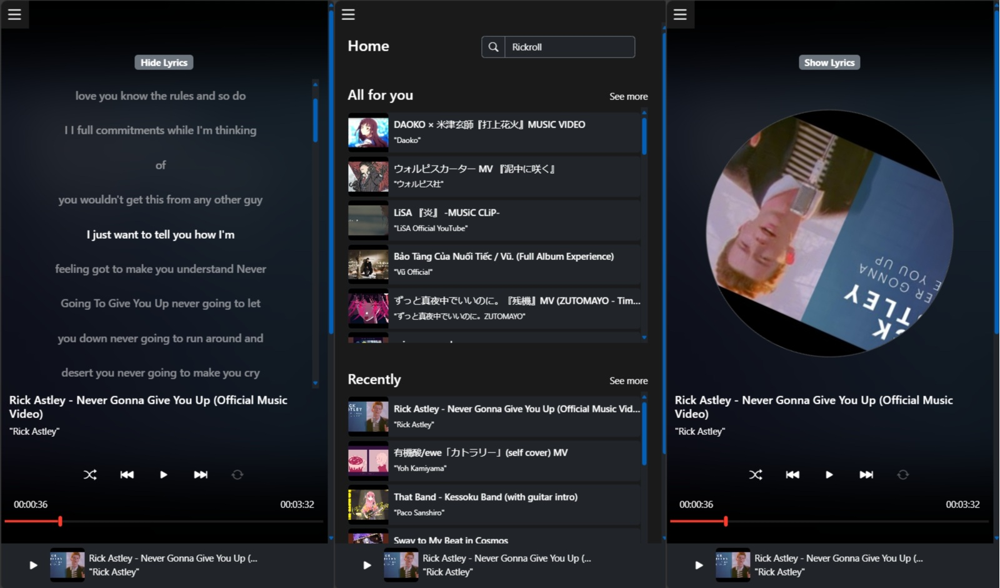

# KonnnMusic

**Mục đích học tập phi thương mại**

## Giới thiệu

KonnnMusic là một ứng dụng web cho phép người dùng tìm kiếm, phát và quản lý các bài hát từ YouTube. Ứng dụng này được xây dựng với mục đích học tập và không nhằm mục đích thương mại.

## Demo

Bạn có thể xem bản demo của ứng dụng tại đây: [KonnnMusic Demo](https://konnn04.github.io/m/)

## Cách chạy server

### Yêu cầu

- Node.js
- npm (Node Package Manager)

### Cài đặt

1. Clone repository này về máy của bạn:
    ```sh
    git clone https://github.com/konnn04/m.git
    cd m
    ```

2. Cài đặt các gói phụ thuộc:
    ```sh
    npm install
    ```

3. Chạy server:
    ```sh
    npm start
    ```

Server sẽ chạy tại `http://127.0.0.1:3000`.

## Cách hoạt động

1. Khi người dùng tìm kiếm bài hát, ứng dụng sẽ gửi yêu cầu đến server để tìm kiếm thông tin bài hát từ YouTube.
2. Server sử dụng [youtubei.js](https://github.com/LuanRT/YouTube.js) và [yt-dlp](http://_vscodecontentref_/1) để tương tác với YouTube API và tải xuống nội dung.
3. Các bài hát sau khi tải xuống sẽ được lưu trữ trong thư mục `public/audios`.
4. Người dùng có thể phát các bài hát đã tải xuống, quản lý danh sách phát và xóa các bài hát không cần thiết.

## Các thư viện đã sử dụng

- **express**: Framework web cho Node.js.
- **cors**: Middleware cho phép chia sẻ tài nguyên giữa các nguồn khác nhau.
- **express-rate-limit**: Middleware giới hạn số lượng yêu cầu từ một IP trong một khoảng thời gian nhất định.
- **axios**: Thư viện HTTP client cho việc gửi các yêu cầu HTTP từ trình duyệt.
- **youtubei.js**: Thư viện không chính thức để tương tác với YouTube API.
- **yt-dlp**: Công cụ tải video từ YouTube và các trang web khác.

## Cấu trúc thư mục
```
├── assets/
│   ├── css/
│   │   ├── jquery.toast.min.css
│   │   └── style.css
│   ├── img/
│   └── js/
│       ├── app.js
│       ├── jquery.toast.min.js
│       └── MusicPlayer.js
├── index.html
├── server/
│   ├── app.js
│   ├── lib/
│   │   ├── cookies.txt
│   │   ├── yt-dlp
│   │   └── yt-dlp.exe
│   ├── public/
│   │   ├── audios/
│   │   │   └── ...
│   │   └── infos/
│   │       └── ...
│   └── yt-dlp.js
└── package.json
```
## Liên hệ

Nếu bạn có bất kỳ câu hỏi nào, vui lòng liên hệ với chúng tôi qua email: [trieukon1011@gmail.com](mailto:trieukon1011@gmail.com]).


## Demo Screenshots

<div class="slider" style="overflow:hidden; position:relative; width:100%; max-width:800px; margin:0 auto;">
    <div class="slides" style="display:flex; transition:transform 0.5s ease;">
        
        
        
        
        
    </div>
    <button onclick="prevSlide()" style="position:absolute; left:10px; top:50%;">&#10094;</button>
    <button onclick="nextSlide()" style="position:absolute; right:10px; top:50%;">&#10095;</button>
</div>


